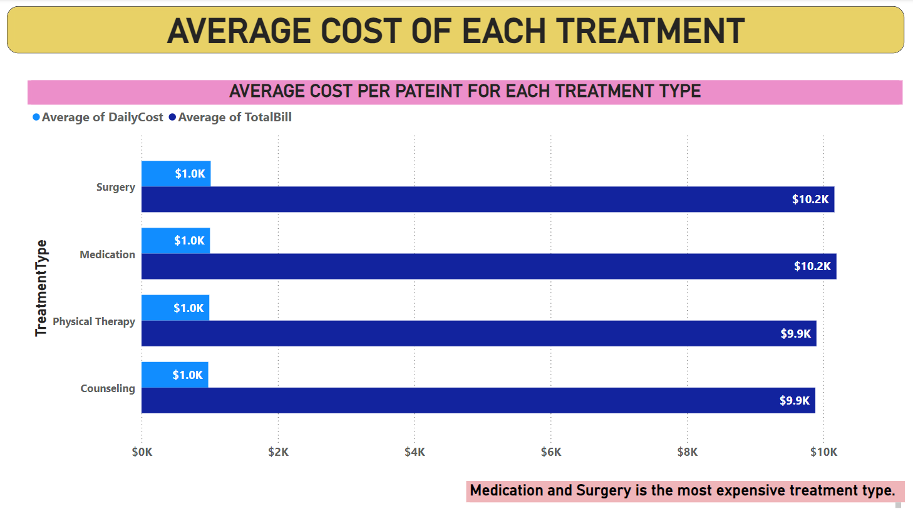

# **Healthcare Analysis Dashboard**

### **Case Study: Advancing Healthcare Analysis through Data Insights**

## **Background**
As a data analyst at HealthStat Solutions, i was tasked with analyzing healthcare data to uncover trends and insights that could improve patient outcomes and optimize hospital operations. This project uses two datasets: 'Patient Medical Records' and 'Hospital Treatment Details'.

## **Objective**
Leverage Power BI to analyze and visualize healthcare data, providing valuable insights into patient care and hospital performance. The aim is to create an interactive dashboard that highlights trends and supports decision-making.

## **Data Source**

### [HealthcareDataset1.xlsx](https://almabetter.notion.site/Healthcare-e941ed5599e64e8f9a0647b29f8762e2)
The "HealthcareDataset1.xlsx" file contains the following columns:

1. **PatientID**: A unique identifier for each patient. (Primary Key)
2. **PatientName**: Name of the patient.
3. **Age**: Age of the patient.
4. **Gender**: Gender of the patient.
5. **BloodType**: Blood type of the patient.
6. **Diagnosis**: The diagnosis given to the patient.
7. **Treatment**: The treatment provided to the patient.
8. **AdmissionDate**: Date when the patient was admitted.
9. **DischargeDate**: Date when the patient was discharged.
10. **TotalBill**: The total bill amount for the patient's treatment.
11. **Full Prescription Details**: Detailed prescription information including medication names, dosages, frequency, and duration.

### [HealthcareDataset2.xlsx](https://almabetter.notion.site/Healthcare-e941ed5599e64e8f9a0647b29f8762e2)
The "HealthcareDataset2.xlsx" file contains the following columns:

1. **PatientID**: A unique identifier for each patient, corresponding to 'PatientID' in "HealthcareDataset1.xlsx". (Foreign Key)
2. **Hospital**: The name of the hospital where the patient was treated.
3. **DoctorName**: Name of the doctor who treated the patient.
4. **RoomNumber**: The room number assigned to the patient.
5. **DailyCost**: The daily cost of the patient's treatment.
6. **TreatmentType**: Type of treatment provided.
7. **RecoveryRating**: A rating of the patient's recovery (out of 10).

# Part 1: Data Cleaning, Modeling, and DAX in Power BI

## Data Preparation and Cleaning

1. **Renaming Datasets**
    - Renamed the first dataset to `patient_data` as it contains information about the patients.
    - Renamed the second dataset to `hospital_data` as it contains information about the hospitals.

2. **Merging Datasets**
    - Merged both datasets by going to the option **Transform Data** and selecting **Merge Queries** on the basis of the common column `PatientID`.

3. **Checking for Null Values**
    - Sequentially checked for null values in each column:
        - **PatientID**: No null values
        - **PatientName**: 60 null values
        - **Age**: No null values
        - **Gender**: No null values
        - **BloodType**: No null values
        - **Diagnosis**: No null values
        - **Treatment**: No null values
        - **AdmissionDate**: No null values
        - **DischargeDate**: No null values
        - **TotalBill**: 2 null values
        - **Prescription**: No null values
        - **HospitalName**: 78 null values
        - **DoctorName**: No null values
        - **RoomNumber**: No null values
        - **DailyCost**: No null values
        - **TreatmentType**: No null values
        - **RecoveryRating**: 78 null values

4. **Checking for Inconsistencies**
    - **Age Column**: Many patients have `0` as age, indicating they might be infants. Checked the diseases they have developed and confirmed with Google that infants can develop these diseases, although rarely. Therefore, age `0` is not considered an inconsistency.
    - **Gender Column**: 334 rows are typed as `Other`. Considering the new era, people often identify themselves as other than male and female. Therefore, either `Other` is correctly written or there is some inconsistency in the gender data. However, it is not feasible to impute 334 values correctly, so this is left as is.
    - Changed the data type of the `AdmissionDate` column to Date.
    - Changed the data type of the `DischargeDate` column to Date.
    - Reduced the decimal values to two digits after the decimal in the `TotalBill` column.
    - Verified that `DailyCost` is much less than the `TotalBill` for all rows.
    - Noted that for all rows, the time interval between `AdmissionDate` and `DischargeDate` is 1 day only. The `TotalBill` varies for different patients, indicating possible additional costs like medicine, room type, or extra facilities.
    - Ensured there are no duplicate rows.

As this is artificially generated data, there will be anomalies. I am not focusing on those anomalies and will proceed with data analysis using Power BI.

5. **Categorizing Age Groups**
    - Create a new column categorizing patients into age groups (e.g., Child, Adult, Senior). What are the predominant age groups?

    

    ### Insights:
    - Adults were the predominant age group among the patients.

6. **Analysis of Treatment Costs**
    - Calculate the total cost of treatment for each patient (consider 'TotalBill' and 'DailyCost'). Which treatments are the most expensive on average?

    

    ### Insights:
    - Medication & Surgical treatments were identified as the most expensive on average.

7. **Gender Distribution in Diagnosis**
    - Analyze the distribution of genders across different diagnoses. Are there any noticeable patterns or trends?

    

    ### Insights:
    - Females are more prone to COVID-19 and hypertension, whereas males are more susceptible to the flu and diabetes..

8. **Blood Type Analysis**
    - Investigate the distribution of blood types among the patients. Is there a blood type that is more prevalent?

    

    ### Insights:
    - Patients with blood groups AB+ and B- are more  than those with other blood types..

9. **Recovery Rating Analysis**
    - Using DAX, analyze the average recovery rating by treatment type. Which treatment type has the highest average recovery rating?

    

    ### Insights:
    - Counseling have the best Recovery ratings among all the treatment types.

10. **Hospital Utilization Analysis**
    - Calculate the average number of patients per room in each hospital. Which hospital has the highest utilization?

    

    ### Insights:
    - Green Valley Medical Center hospital have the highest utilization..

11. **Doctor's Patient Load**
    - Analyze which doctor has treated the most patients. Does a higher patient load correlate with lower recovery ratings?

    

    ### Insights:
    - David Moore has treated most patients and With increase in number of patient per doctor average recovery ratings decreases.s.

12. **Treatment Effectiveness**
    - Compare the length of stay against the recovery rating for different treatment types. Which treatment shows the most effectiveness?

    

    ### Insights:
    - Recovery ratings have no relation with Length of Stay.  All the Treatment Type have almost same Recovery Ratings..

13. **Cost Analysis by Hospital**
    - Investigate the average treatment cost per patient in each hospital. Which hospital has the highest and lowest costs?

    

    ### Insights:
    - Cedar Sinai Clinic Hospital is most costly and Riverside Hospital is least costly.t.

14. **Patient Admission Trends Over Time**
    - Analyze the trends in patient admissions over time. Are there any seasonal patterns?

    

    ### Insights:
    - No seasonal trend is found in patient admissions over time .

15. **Correlation Between Age and Recovery**
    - Explore if there's a correlation between patient age and recovery rating.

    

    ### Insights:
    - With increase in age the average recovery ratings slightly increases..

16. **Analyzing Room Efficiency**
    - Create a measure to analyze the efficiency of room usage (number of patients per room versus average length of stay).

    

    ### Insights:
    - Insights are shown in the chart above.

17. **Impact of Doctor on Recovery**
    - Analyze if the treating doctor has a significant impact on the patient's recovery rating.

    

    ### Insights:
    - Recovery ratings varied significantly depending on the treating doctor.

18. **Length of Stay and Cost Correlation**
    - Using DAX, explore the correlation between the length of stay and total treatment cost.

    

    ### Insights:
    - There is no correlation between days in hospital and total cost..

19. **Recovery Trends by Gender and Age Group**
    - Analyze recovery trends across different genders and age groups.

    

    ### Insights:
    - Insights are shown in the chart above.

20. **Extracting Key Information**
    - Using the 'Full Prescription Details' column in the updated Healthcare Dataset 1, create a new column that lists only the names of the medications and their dosages for each patient. Exclude other details like frequency and duration from this column.

    

    ### Insights:
    - Key medication information was extracted successfully, simplifying the dataset.

### Dashboard 1:

### Dashboard 2:

### Dashboard 3:

## Conclusion
This project showcases the use of Power BI for comprehensive data analysis and dashboard creation to delve into detailed datasets from the healthcare industry. By merging and cleaning the data, employing DAX functions, and designing interactive dashboards, we have extracted valuable insights into patient demographics, treatment outcomes, hospital performance, and cost implications.

These insights can significantly enhance the understanding of patient care dynamics and operational efficiencies within healthcare facilities. The analysis highlights critical trends and patterns, aiding healthcare providers in making informed decisions to improve patient outcomes and optimize hospital operations.

Feel free to explore the Power BI files and documentation provided in this repository to gain a deeper understanding of the project and replicate the results. If you have any questions or suggestions, please don't hesitate to reach out to [email](jabcd.1997@gmail.com).

Happy Analyzing!
